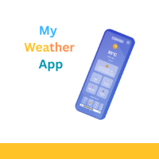

# Desire Vargas Portfolio

Welcome to my portfolio! I am **Desire Vargas**, a passionate web developer currently pursuing a Bachelor’s Degree in Software Development. This portfolio showcases my skills, education, and projects that I have worked on.

 <!-- Replace with your project image URL -->

## Live Demo

Check out the live demo of my portfolio [here](https://your-live-demo-link.com) <!-- Replace with your live demo link -->

## Table of Contents

- [About Me](#about-me)
- [Education](#education)
- [Skills](#skills)
- [Projects](#projects)
- [Contact](#contact)
- [Contributing](#contributing)
- [License](#license)

## About Me

I am a student, software developer, and web designer with a passion for logical problem-solving and creative expression. I enjoy combining analytical skills to build efficient solutions while also focusing on design and user experience. I am bilingual in Spanish and English, which allows me to collaborate effectively in diverse teams and global projects.

## Education

- **PathwayConnect Certificate**  
  *PathwayWorldwide*  
  April 2022 - April 2023

- **Certificate in Web and Computer Programming**  
  *BYU-Idaho*  
  October 2024

- **Certificate in Software Development**  
  *BYU-Idaho*  
  April 2025

- **Certificate in Web Development**  
  *BYU-Idaho*  
  August 2025

- **Associate Degree in Software Development**  
  *BYU-Idaho*  
  August 2025

- **Bachelor’s Degree in Software Development**  
  *BYU-Idaho*  
  October 2025

- **Certificate in Graphic Design Fundamentals**  
  *BYU-Idaho*  
  December 2025

## Skills

- HTML
- CSS
- JavaScript
- React
- Node.js
- MongoDB
- MySQL
- C#
- Python
- Postman
- Tailwind CSS
- Swagger
- Canva
- PostgreSQL

## Projects

### My Weather App
 <!-- Replace with your project image -->
A Weather App that provides weather information, forecasts, and suggestions about possible activities according to your local weather.  
[GitHub](https://github.com/desivar/My-Weather-App) | [Live Demo](https://desivar.github.io/My-Weather-App/weather2.html)

### Bridebloom
 <!-- Replace with your project image -->
A responsive prototype design for a virtual wedding flower shop.  
[GitHub](https://github.com/desivar/bridebloom) | [Video Demo](https://bridebloom-frontend.onrender.com/)

### Chemistry Lab
 <!-- Replace with your project image -->
A web-based interactive chemistry simulator that allows users to mix elements and observe chemical reactions in real-time.  
[GitHub](https://github.com/desivar/mychemistrylab) | [Live Demo](https://desivar.github.io/mychemistrylab/)

## Contact

Feel free to reach out to me via [WhatsApp](https://wa.me/50498497898) or connect with me on social media:

- [Twitter](https://twitter.com)
- [Instagram](https://instagram.com)
- [LinkedIn](https://www.linkedin.com/in/desire-delmy-vargas-tinoco-853381247/)
- [GitHub](https://github.com/desivar?tab=repositories)
- [YouTube](https://www.youtube.com/@CodingalongwithD)

## Contributing

Contributions are welcome! If you have suggestions for improvements or new features, please fork the repository and submit a pull request.

1. Fork the repository.
2. Create your feature branch:
   ```bash
   git checkout -b feature/YourFeature
